Introducing "Morsse" – a morse code learning platform where morse code beginners or amateurs can improve their skills by completing lessons of sending and receiving morse code signals. This app is for:

-   Amateur Radio Enthusiasts needing practice for obtaining the license.
-   Personal Challenge Seekers looking to master another skill.

Many existing morse code practice apps don't offer lessons of different varieties or accounts for tracking progress. Morsse aims to bridge the gap, providing lessons for users of all skill levels alike and allowing for continuous learning.

## 🧱 Core Functionality

-   **Lesson Creation:** Users can create new lessons with:
    -   A title describing content of the lesson.
    -   Sections of practice of sending or receiving text in morse code.
    -   A number representing its difficulty (1-5). 
-   **Lesson Retrieving:** Users can search up existing lessons sorted in differnet ways.
-   **Lesson Deletion:** A user can choose to delete the lesson created by self.
-   **Lesson Use:** Users can complete the lesson by sections to solidify their skill.

### Requirements

#### Lesson Stories

-   As a user, I want to create a lesson with sections so that it can be shared with others.
-   As a user, I want to delete a lesson created by me so that I can undo unwanted changes.
-   As a user, I want to take a lesson by sections so that I can improve my skills.
-   As a user, I want to keep track of the lessons I completed so that I won't repeat already taken lessons.

#### User Management Stories

-   As a user, I want to register for an account so that I can start using the app.
-   As a user, I want to log in to my account so that I can create new lessons or take existing lessons.
-   As a user, I want to log out of my account so that I can securely end my session.
-   As a user, I want to view profile of myself and other users so that I can know these users better.
-   As a user, I want to change my preferences so that I can personalize my experience on the website.
-   As a user, I want to delete my account if needed so that I can protect my privacy.
-   As a user, I want my reputation to increase when my lesson is completed so that more people will know about my lessons.

## ᛦ Entity Relationships

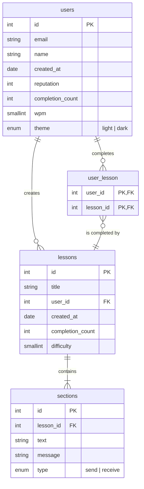

-   **Authentication System:** Handling user registration, login, logout, and session management.
-   **Lesson Management:** Logic for lesson creation, retrieval, deletion and completion.
-   **Morse Code System:** Logic for converting signals into text or converting text into signals.
-   **UI Elements:** Design of forms, lessons list, lesson view and profile view.

## 📍 API Routes

### Lesson Management

| Request                       | Action                                  | Response               | Description                                                               |
| ----------------------------- | --------------------------------------- | ---------------------- | ------------------------------------------------------------------------- |
| POST /lessons                 | LessonController::create                | 400 /lessons           | Displays an error if data is invalid                                      |
| POST /lessons                 | LessonController::create                | 403 /error             | Displays an error if user is not logged in                                |
| POST /lessons                 | LessonController::create                | 201 /lessons/:id       | Creates a new lesson and redirects to the lesson view                     |
| DELETE /lessons/:id           | LessonController::delete                | 403 /error             | Displays an error if user did not create this lesson                      |
| DELETE /lessons/:id           | LessonController::delete                | 404 /error             | Displays an error if lesson is not found                                  |
| DELETE /lessons/:id           | LessonController::delete                | 204 /lessons           | Deletes a lesson and its sections, then redirects to the lesson list view |
| GET /lessons/:id              | LessonController::get                   | 404 /lessons           | Displays an error if lesson is not found                                  |
| GET /lessons/:id              | LessonController::get                   | 200 LessonView         | Retrieves overview of a lesson                                            |
| GET /lessons                  | LessonController::getList               | 400 /error             | Displays an error if filter parameters are invalid                        |
| GET /lessons                  | LessonController::getList               | 200 LessonListView     | Retrieves a list of lessons                                               |
| GET /lessons/create           | LessonController::getLessonCreationForm | 200 LessonCreationView | Retrieves a form for creating lessons                                     |
| GET /lessons/:id/sections/:id | LessonController::getSection            | 404 /error             | Displays an error if lesson or section is not found                       |
| GET /lessons/:id/sections/:id | LessonController::getSection            | 403 /error             | Displays an error if user is not logged in                                |
| GET /lessons/:id/sections/:id | LessonController::getSection            | 200 SectionView        | Retrieves section of a lesson                                             |
| PUT /lessons/:id/complete     | LessonController::getSection            | 400 /lessons/:id       | Displays an error if lesson isn't completed just now                      |
| PUT /lessons/:id/complete     | LessonController::getSection            | 200 SectionView        | Retrieves section of a lesson                                             |

### User Management

| Request           | Action                 | Response            | Description                                                      |
| ----------------- | ---------------------- | ------------------- | ---------------------------------------------------------------- |
| POST /register    | UserController::create | 400 /register       | Displays an error if data is invalid                             |
| POST /register    | UserController::create | 201 /login          | Creates a new account                                            |
| DELETE /users/:id | UserController::delete | 403 /login          | Displays an error if user is not logged in with the same account |
| DELETE /users/:id | UserController::delete | 204 /               | Deletes an account                                               |
| GET /users/:id    | UserController::read   | 404 /error          | Displays an error if user is not found                           |
| GET /users/:id    | UserController::read   | 200 ProfileView     | Gets profile of a user                                           |
| PUT /users/:id    | UserController::update | 403 /error          | Displays an error if user is not logged in with the same account |
| PUT /users/:id    | UserController::update | 200 /users/:id/edit | Displays an error if data is invalid                             |
| PUT /users/:id    | UserController::update | 200 /users/:id/edit | Updates profile of a user                                        |

### Authentication System

| Request             | Action                          | Response             | Description                                                      |
| ------------------- | ------------------------------- | -------------------- | ---------------------------------------------------------------- |
| GET /register       | AuthController::getRegisterForm | 200 RegisterFormView | Gets the register form                                           |
| GET /login          | AuthController::getLoginForm    | 200 LoginFormView    | Gets the login form                                              |
| GET /users/:id/edit | AuthController::getSettingsForm | 404 /error           | Displays an error if user is not found                           |
| GET /users/:id/edit | AuthController::getSettingsForm | 403 /error           | Displays an error if user is not logged in with the same account |
| GET /users/:id/edit | AuthController::getSettingsForm | 200 SettingsView     | Gets the settings form                                           |
| POST /login         | AuthController::login           | 400 /login           | Displays an error if credentials are invalid                     |
| POST /login         | AuthController::login           | 200 /                | Logs an user in                                                  |
| POST /logout        | AuthController::logout          | 400 /login           | Displays an error if user is already logged out                  |
| POST /logout        | AuthController::logout          | 200 /login           | Logs an user out                                                 |

### Miscellaneous

| Request    | Action   | Response      | Description         |
| ---------- | -------- | ------------- | ------------------- |
| GET /      | getHome  | 200 HomeView  | Gets the home page  |
| GET /error | getError | 200 ErrorView | Gets the error page |

## 📐 Wireframes

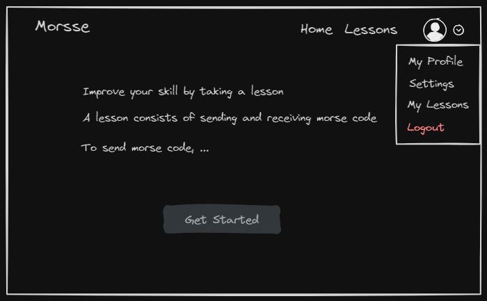

Home page of morsse containing instructions on how to get started.

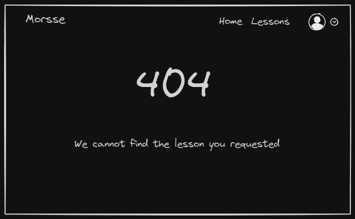

A page displaying error messages (e.g. access forbidden, entity not found, invalid data).

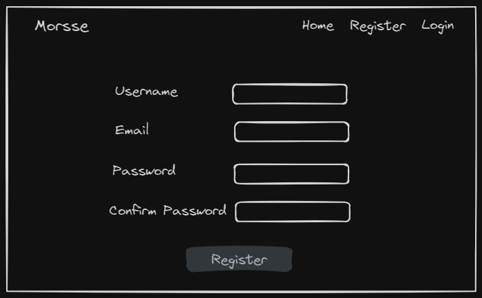

A registration form allowing users to create new accounts in order to create new lessons or take existing lessons. Contains username, email, password and confirm password. A successful registration redirects the user to the login form, a failed registration (due to unmatched password, already taken username, etc) sends the user back to the same page with an error message.

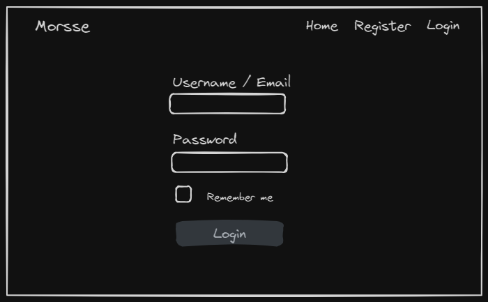

A login form allowing users to sign into the account. Contains a field for username or email a field for password, and an option for remembering the user's email. A successful login redirects the user to the home page, a failed login (due to empty fields, invalid credentials, etc) sends the user back to the same page with an error message.

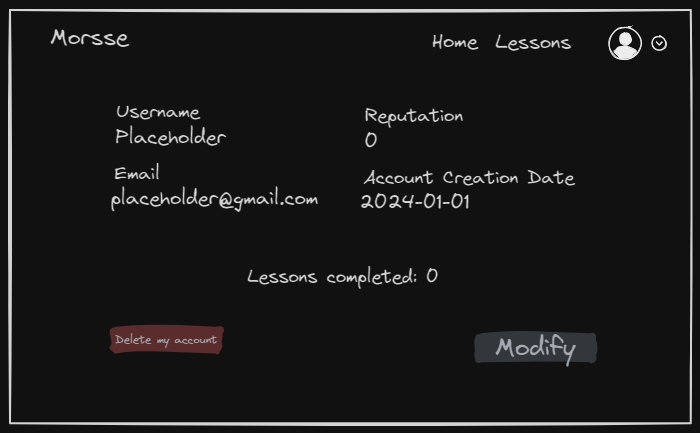

A profile page containing information of a user (username, email, reputation, account creation date, number of lessons completed). Also contains an option to delete the account and an option to modify the account. If the account is deleted, the user is redirected to the home page; if the option of modifying account is chosen, the user is redirected to the settings page.

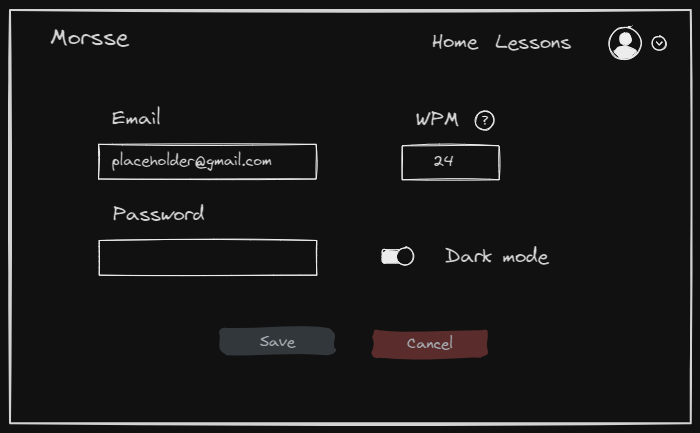

A settings page containing information of the account. Gives options to modify email, password, wpm (word per minute, speed for sending and receiving signal) and theme (light mode or dark mode). There's a save option, which saves the changes and sends the user back to the same page. There's also a cancel option, which discards the changes and sends the user back to the same page. 

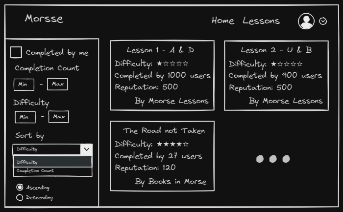

A page containing the list of created lessons. Gives options to select only finished or unfinished lessons, the number of users that completed a lesson, the difficulty of a lesson, sort the list of lessons by difficulty or number of users that completed the lesson in ascending or descending order. Contains title, difficulty, completed user count, reputation of creator and creator name of each lesson retrieved. The user can select a lesson to be redirected to the lesson page to get more details about it, take it, or delete it (only if the lesson is created by that user).

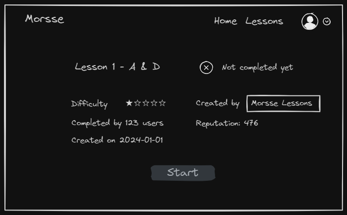

A page containing information of a lesson (title, difficulty, completed user count, creation date, creator name, creator reputation and a flag indifcating if lesson is completed by the user) as well as an option to take the lesson, which redirects the user to section view and allows the user to start working on it.

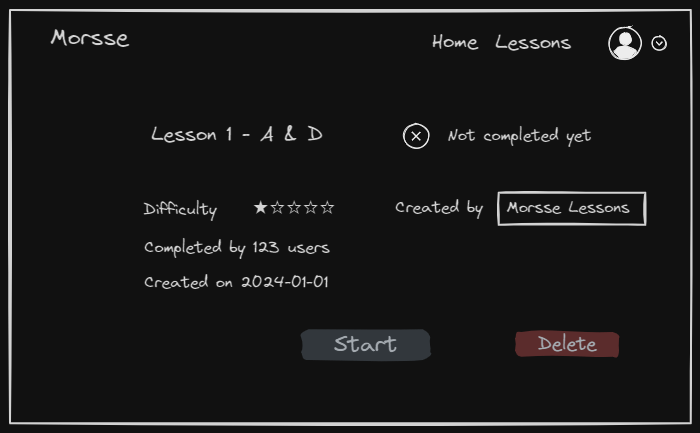

A page containing information of a lesson, an option to take the lesson and an option to delete it. This page will only displayed to creators of the lesson. The delete option deletes the lesson upon selection, and redirects the user to the list of lessons.

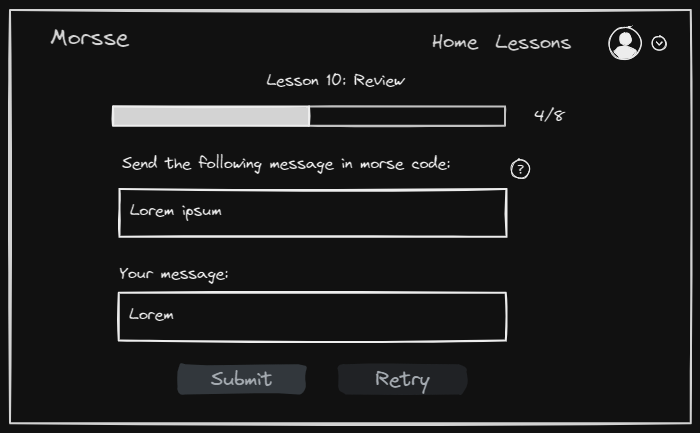

A page representing section of a lesson. Contains the lesson title, progress bar, current section and total number of sections in the lesson, question, answer, submit button (submits the answer and goes to the next section if the answer is correct or goes to the same section with the correct answer if the submitted answer is wrong), retry button (clears the current answer) and an option to get help (contains instructions on how to complete the question).

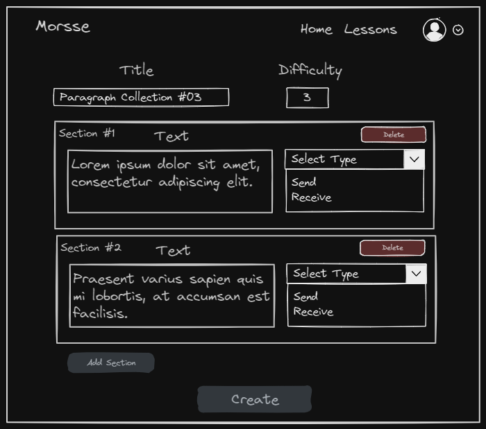

A page that allows the user to create a new lesson. Contains fields for title, difficulty of a lesson, as well as sections (contains text and type (send ore receive) of the section, and an option to delete it), an option to add sections and an option to create the lesson. The create option upon selected makes an attempt to create the lesson with given data. If successful, the user is redirected to the page of the lesson created; otherwise the user is redirected to the list of lessons.