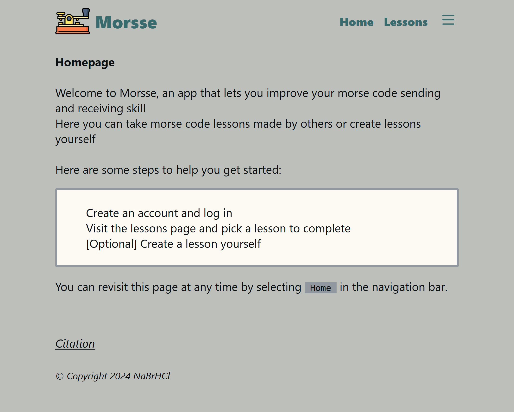
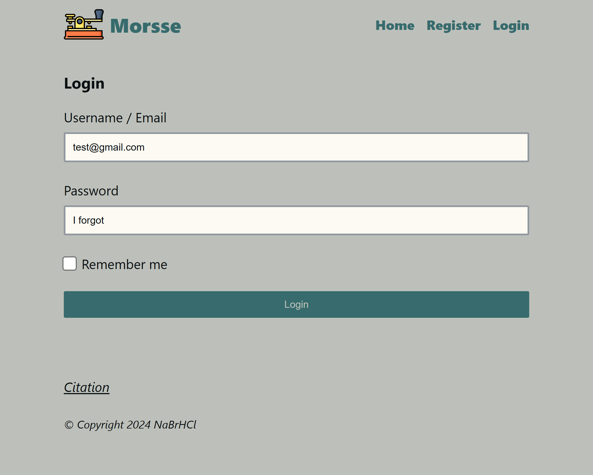
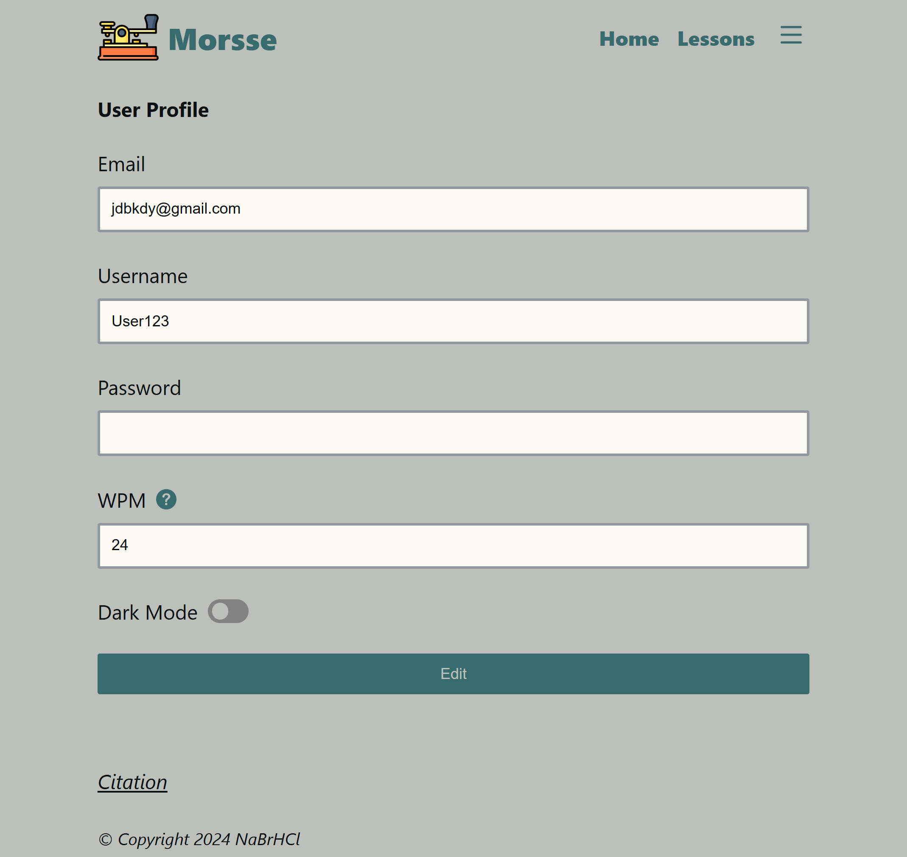
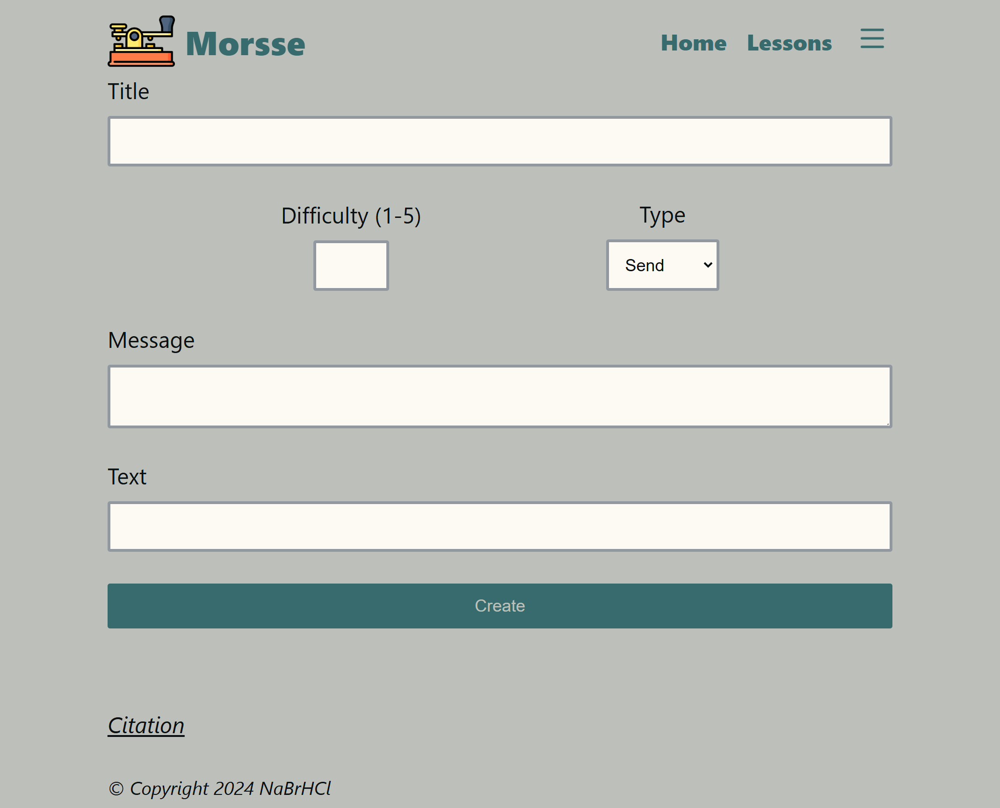
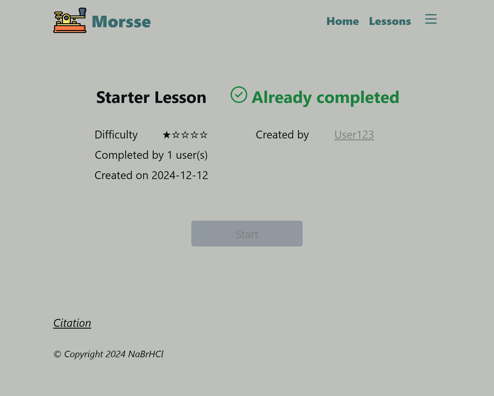
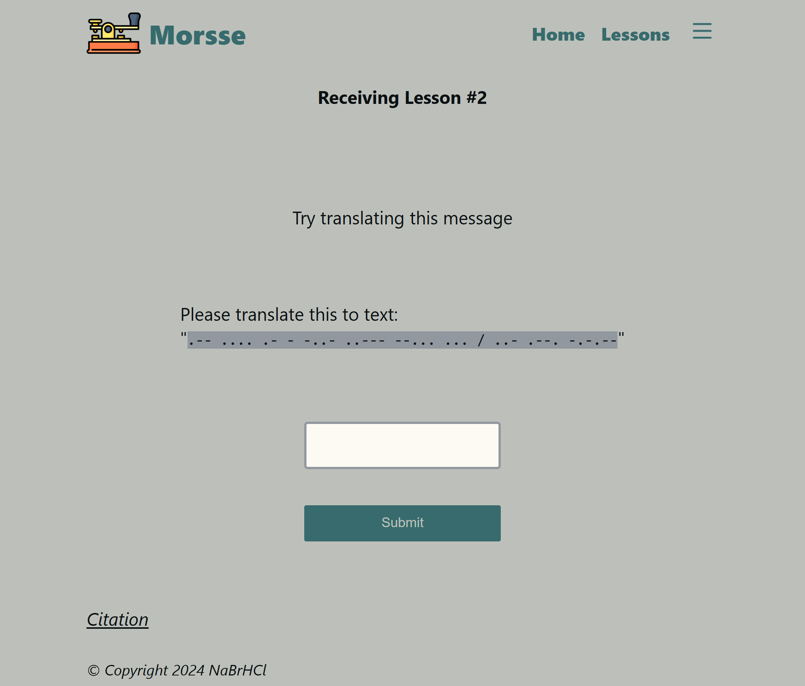

# Morsse

## Overview
A morse code learning platform built with TypeScript, Handlebars.js, and PostgresSQL 
Courses for sending/receiving morse code can be created and shared on the platform. 
Accounts can be created to track user preferences (e.g. light/dark mode, [WPM](https://morsecode.world/international/timing.html)) and save learning progress (course completion) 
Check out [Planning](Planning.md) for more details

Home Page

Login

Settings

Lesson Creation

Lesson Overview

Lesson Example (Receiving)
